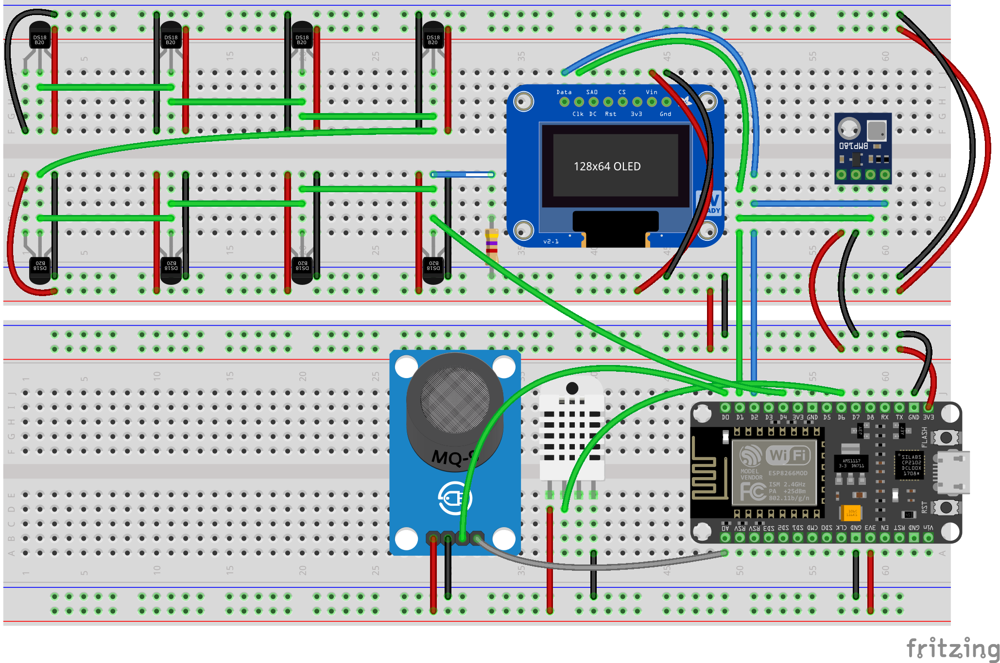

# adruino-air-state-server

Air quality monitor built with NodeMCU and following sensors:

* MQ135;
* BMP180;
* DHT22;
* DS18B20;
* SSD1306.

It connects to given network specified in `secrets.h` and returns registered data on `/circumstances` handle.

Beneath, you can see the circuit diagram:

As well as finished project:

___

***Note:*** Project is managed by [async-httpd-data-collector](https://github.com/straightchlorine/async-httpd-data-collector),
which is an asynchronous gateway between NodeMCU and InfluxDB. Similar results could be achieved by simply utilising
the [ESP8266 Influxdb](https://www.arduino.cc/reference/en/libraries/esp8266-influxdb/) library, which facilitates connection to the
database from the device itself.
